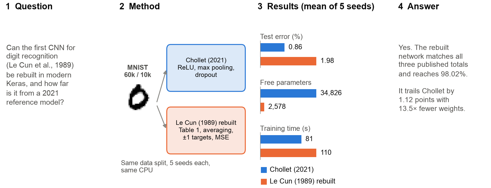
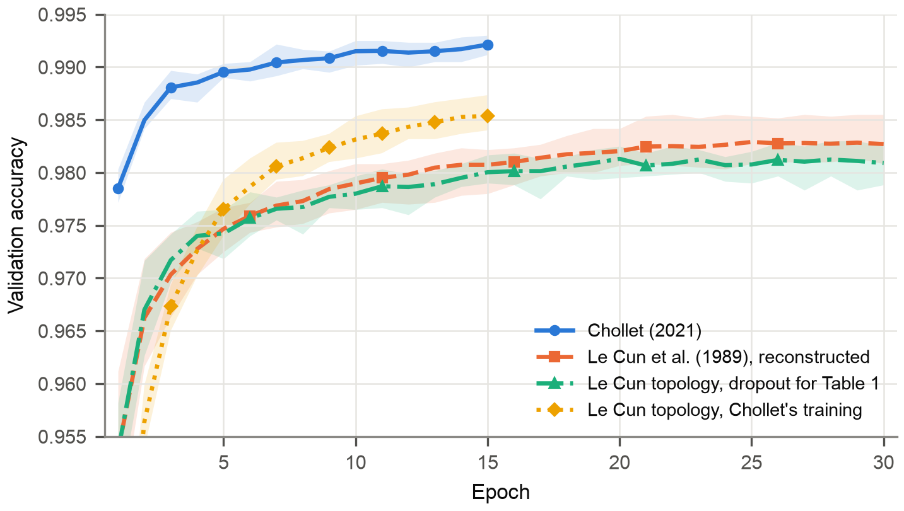

# Rebuilding Le Cun et al. (1989) in Keras

[](https://github.com/Mystique1337/lecun-1989-mnist-reproduction/actions/workflows/ci.yml)

A Keras 3 reconstruction of the convolutional network in *Handwritten digit recognition with a back-propagation network* (Le Cun et al., 1989), built by modifying François Chollet's [Simple MNIST convnet](https://keras.io/examples/vision/mnist_convnet/) and compared with it on MNIST.

The rebuilt network reproduces the paper's published totals of 4,635 units, 98,442 connections and 2,578 free parameters exactly, including the sparse H2 to H3 connection scheme of the paper's Table 1. Both networks were trained with five seeds on the same data split, and every design choice for the reconstruction was made on a validation set before the test set was touched.



## Results

Test-set results, mean ± standard deviation over five seeds. All runs used one Apple M4 machine (TensorFlow 2.21, Keras 3, CPU only).

| Model | Parameters | Test loss | Test accuracy (%) | Training time (s) | Time per epoch (s) |
|---|---:|---|---:|---:|---:|
| Chollet (2021) | 34,826 | 0.0260 ± 0.0027 (CE) | **99.14 ± 0.11** | 80.9 ± 0.3 | 5.39 |
| Le Cun et al. (1989), reconstructed | 2,578 | 0.0429 ± 0.0010 (MSE) | 98.02 ± 0.04 | 110.2 ± 1.0 | 3.67 |
| Le Cun topology, dropout instead of Table 1 | 3,278 | 0.0439 ± 0.0007 (MSE) | 97.76 ± 0.07 | 117.4 ± 0.5 | 3.91 |
| Le Cun topology, Chollet's training recipe | 2,578 | 0.0510 ± 0.0021 (CE) | 98.31 ± 0.09 | 32.8 ± 0.2 | 2.18 |

CE is categorical cross-entropy and MSE is mean squared error, so the two loss columns are not comparable with each other. Source: [`results/tables/t07_headline.csv`](results/tables/t07_headline.csv).

What the numbers say:

- **The gap is real but small.** Chollet's network is 1.12 percentage points more accurate (95% CI 0.98 to 1.26) with 13.5 times as many parameters. An exact McNemar test on each seed's paired predictions is significant on all five seeds.
- **Most of it comes from the network, not the training.** Training the 1989 network with Chollet's recipe (softmax, cross-entropy, Adam, batch size 128, 15 epochs) recovers 0.29 pp. The remaining 0.83 pp separates the two networks trained identically.
- **Dropout is a poor substitute for Table 1.** Replacing the sparse connections with full connections plus dropout lowers accuracy by 0.26 pp (worse on every seed). A network of 2,578 parameters underfits rather than overfits, so removing units only removes capacity.
- **The smaller network is not slower per step.** Each epoch of the reconstruction takes 3.67 s against 5.39 s. It trains longer overall only because 30 epochs at batch size 32 perform eight times as many weight updates. On Chollet's schedule it finishes in 32.8 s.
- **The extra errors are concentrated.** The reconstruction misreads the digit 4 on 3.05% of test images against 0.43% for Chollet's network, most often as a 9, followed by 7 (2.80% against 0.99%) and 3 (1.82% against 0.48%).



---

## How faithful is the reconstruction?

Le Cun et al. (1989, p. 402) give three totals for their network. The Keras model reproduces all three exactly, derived from the layer definitions alone:

| Quantity | Paper (p. 402) | This reconstruction |
|---|---:|---:|
| Units (including the bias unit) | 4,635 | 4,635 |
| Connections | 98,442 | 98,442 |
| Independent parameters | 2,578 | 2,578 |

Matching all three confirms the layer sizes, kernels, weight and bias sharing and the *number* of H2 to H3 connections. The totals do not depend on *which* 20 of the 48 possible connections are present, so the pattern of Table 1 is checked separately against a second, independent transcription of the paper's table. `tests/test_models.py` asserts the totals and the pattern on every commit.

Two layers had no Keras equivalent and are implemented in [`src/lecun1989/layers.py`](src/lecun1989/layers.py):

- **`ConnectionTableConv2D`** is a convolution in which each output map reads only the input maps its connection table allows. It stores only the 20 kernels of Table 1, so Keras reports 512 parameters for H3 rather than the 1,212 a dense `Conv2D` would have. Absent connections are structurally zero and never receive a gradient.
- **`TrainableSubsampling2D`** is the H2/H4 layer: a 2×2 average multiplied by one trainable weight per map, plus one bias per map, then the squashing function. `AveragePooling2D` has no parameters, so it could not reproduce the published count.

---

## Reproducing the results

```bash
git clone https://github.com/Mystique1337/lecun-1989-mnist-reproduction.git
cd lecun-1989-mnist-reproduction
python -m venv .venv && source .venv/bin/activate
pip install -r requirements.txt
pip install -e .

pytest                                   # 37 tests, about 10 seconds
jupyter nbconvert --to notebook --execute --inplace \
    notebooks/lecun1989_vs_chollet2021.ipynb   # about 50 minutes on an Apple M4 CPU
```

`requirements.txt` gives minimum versions. `requirements-lock.txt` pins the exact versions that produced the committed results (Python 3.12, TensorFlow 2.21.0, Keras 3.15.1). Accuracies are deterministic for a given seed and software stack, but other versions or hardware may change the last digits, and training times depend on the machine.

The notebook writes every table to `results/tables/`, every figure to `results/figures/`, and a machine-readable record of every headline number to `results/metrics/results.json`. All three are committed, so the numbers below can be checked without rerunning anything.

For a quick end-to-end check, smoke mode runs every cell with one epoch and two seeds and writes to a scratch folder, leaving the committed results untouched (about two minutes; CI runs it on every push):

```bash
mkdir -p /tmp/smoke
LECUN1989_SMOKE=1 LECUN1989_OUT=/tmp/smoke jupyter nbconvert --to notebook --execute \
    --output-dir /tmp/smoke --output smoke notebooks/lecun1989_vs_chollet2021.ipynb
```

**Protocol.** The optimiser, learning rate and dropout substitute for the reconstruction were all chosen on the validation set, with the selection rule fixed in advance. The test set is touched once per run, after every choice is made. All models use the identical 54,000 / 6,000 / 10,000 partition (Keras' `validation_split=0.1` takes the last 6,000 training images). Runs are seeded, TensorFlow kernels are deterministic, and runs are interleaved by seed so that machine-load drift affects every configuration equally.

---

## Repository layout

```
src/lecun1989/
  layers.py      ConnectionTableConv2D, TrainableSubsampling2D, Table 1, scaled tanh
  models.py      build_chollet_2021, build_lecun_1989, network accounting
  data.py        MNIST loading and the Keras-identical partition
  training.py    recipes, seeded and timed training runs
  stats.py       confidence intervals, exact McNemar test, confusion matrix
  figures.py     every figure in the report
notebooks/
  lecun1989_vs_chollet2021.py     source (jupytext percent format, diff-friendly)
  lecun1989_vs_chollet2021.ipynb  the executed notebook with all outputs
tests/           37 tests: published totals, Table 1, layer behaviour, data, statistics
results/         committed tables, figures, metrics and seed-0 models
```

---

## Sources

- Le Cun, Y., Boser, B., Denker, J. S., Henderson, D., Howard, R. E., Hubbard, W., & Jackel, L. D. (1989). Handwritten digit recognition with a back-propagation network. In D. S. Touretzky (Ed.), *Advances in neural information processing systems 2* (pp. 396–404). Morgan Kaufmann.
- Chollet, F. (2021). *Simple MNIST convnet*. Keras code examples. https://keras.io/examples/vision/mnist_convnet/ . Cited as Chollet (2021) throughout; the page itself records creation on 2015-06-19 and last modification on 2020-04-21.
- LeCun, Y., Bottou, L., Bengio, Y., & Haffner, P. (1998). Gradient-based learning applied to document recognition. *Proceedings of the IEEE, 86*(11), 2278–2324. https://doi.org/10.1109/5.726791

`build_chollet_2021` and its training settings are adapted from Chollet's example, which is distributed under the Apache License 2.0 as part of keras-io. See [LICENSE](LICENSE) for the notice.

## License

MIT for this repository's own code; see [LICENSE](LICENSE). MNIST is downloaded at run time through `keras.datasets` and is not redistributed.
